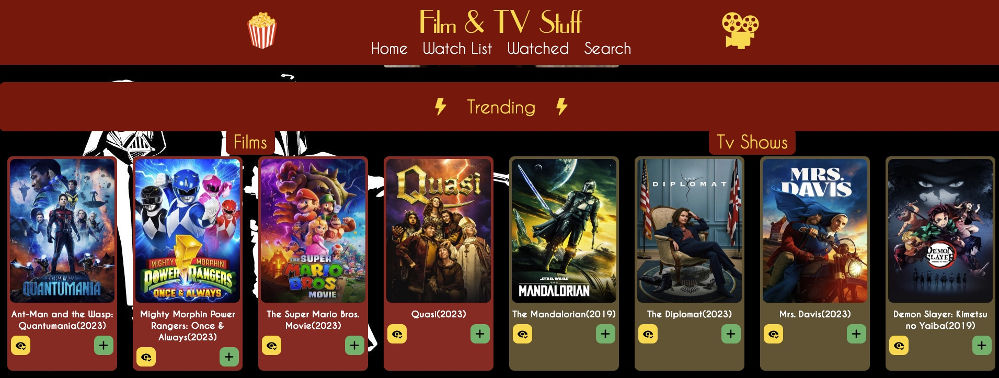
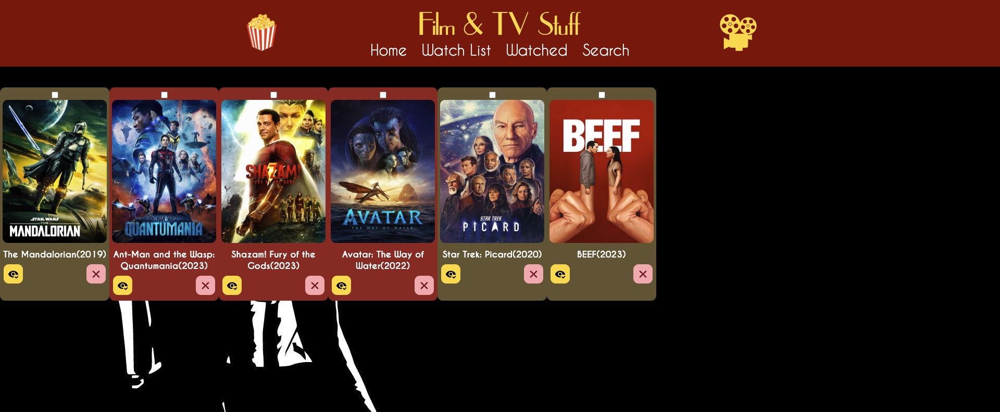
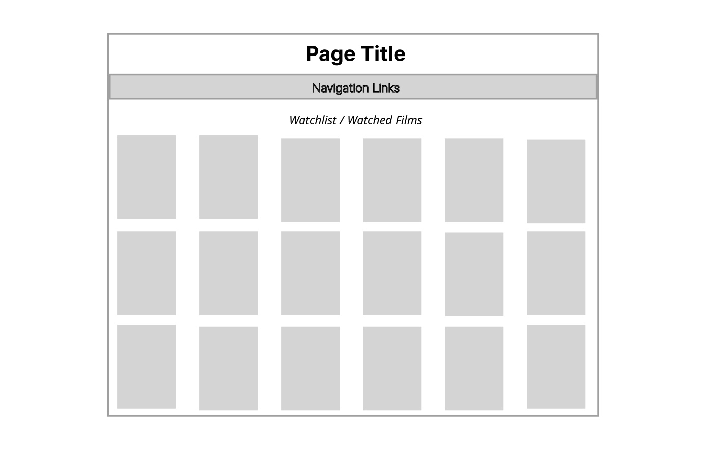
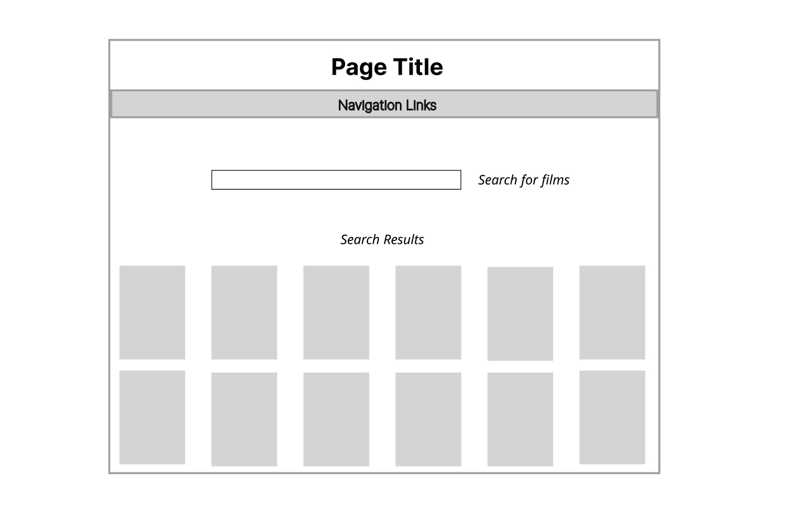
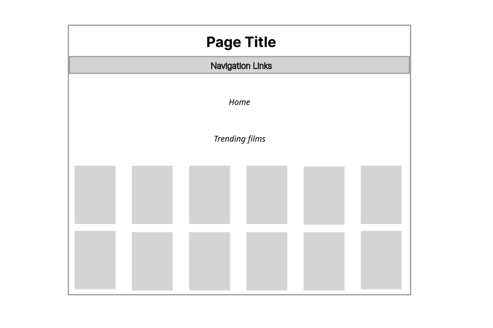

# Project 2 - React List App

Overview

1. Description
2. Deployment Link
3. Installation
4. Technologies Used
5. Deliverables
6. Planning
7. Build Process
8. Challenges
9. Wins
10. Key Learnings & Takeaways
11. Future Improvements

## 1. Description

The goal of this project was to create an SPA from scratch as part of the curriculum for the General Assembly Software Engineering Immersive Course. With the objective of building a front-end list based application that updates the UI and makes requests to the API, I used ReactJS and CSS to create a movie and tv watchlist.
The user can add movies to a 'watched' and 'to-watch' list, mark them as watched as well as edit and remove them from the list. The user also has the option to pick movies and tv shows from a public API.

 

---

## 2. Deployment link

- The project is hosted online on GitHub pages: https://catherineloesch.github.io/project-2-react-film-app/
- Git Repository: https://github.com/catherineloesch/project-2-react-film-app
- issue tracker: https://github.com/catherineloesch/project-2-react-film-app/issues

## 3. Installation

- 'install react router'

## 4. Technologies Used

This application is based in ReactJS, JavaScript, JSX and CSS.

### Additional tools used:

- Figma: a design tool used for building the wireframe
  Visual Studio Code (VSCode): code editor used for writing CSS, JSX and JavaScript
- Google Chrome Web Browser: used for launching the website and displaying the application
  Google Chrome Developer Tools: For troubleshooting and debugging
- Git/GitHub (for version control) and Github pages(for deployment)
- React Router

  - https://reactrouter.com/en/main

- React Youtube
  - https://www.npmjs.com/package/react-youtube

### External web resources:

- icons
  - all icons used are Scalable Vector Graphics from iconify (open source svg library)
  - https://iconify.design/
- sourcefonts: FontSquirrel (https://www.fontsquirrel.com/)
  - caviarDreams (https://www.fontsquirrel.com/fonts/caviar-dreams)
  - upperEastSide (https://www.fontsquirrel.com/fonts/uppereastside)
- API used: TMDB - The Movie Database
  - https://www.themoviedb.org/?language=en-GB

## 5. Deliverables

- Build a web application from scratch
- Use React with create-react-app to build application.
- Plan application using wireframes and user stories
- Deploy app online to GitHub Pages, Surge, or any hosting service
- the user must be able to:
  - Add a new item to a list
  - Mark the item as complete/favorite/(watch, read, listen) later/flag/etc
  - Edit an item from a list
  - Remove an item from a list
  - Clear/delete all items
  - Clear/delete only marked items
  - Fetch data from at least one 3rd party API using Axios or fetch.
  - Make frequent Git commits with descriptive messages, explaining your commit.
  - Use React Router to handle multiple pages/views.

### Potential Extra Features

- Another 3rd Party API
- Incorporate another API in your application
- Use React.Context to pass props down to children
- Make the app Responsive
- Save the data to localStorage or an API
- Use 1 or more 3rd party libraries
- Use a React component library like Ant Design, Bootstrap React, or Material UI
- Use a CSS library like Bootstrap
- Add User Sign Up, Sign In, and Sign Out with Firebase and React Authentication

### User stories

- As a user, I should be able to add a movie to my watchlist.
- As a user, I should be able to mark a movie as watched.
- As a user, I should be able to remove a movie from my watchlist.
- As a user, I should be able to clear all movies from my watchlist.
- As a user I should be able to clear a selection of movies from the watchlist.
- As a user, I should be able to search for movies from an external source.
- As a user, I should be able to edit a movie.

## 6. Planning

---

## 7. Planning

### Day 1 - 14/04/2023

After brainstorming project ideas, I decided to settle on an application that enables the user to make lists of movies and tv shows they want to watch or have seen before.
I then proceeded to creating a wireframe on figma and looked into different entertainment APIs and decided on TMDB (the Movie Database).

After initialising a git repo used the 'create-react-app' and 'install react router' to start the application. I also ran the 'install react rout

### Day 2 - 15/04/2023

On the second day I set up react router for the different pages. I set up 4 different pages: - homepage - watchlist - watched list - search

I also got a key for the TMDB database to retrieve the data and set up the basic structure and css for my application.

### Day 3 - 16/04/2023

On the third day I added more CSS to the homepage and made it display some trending tv shows and movies. I also made the film and tv items appear in different colours so they're easily distinguishable.

### Day 4 - 17/04/2023

On the fourth day I focused on removal of list items.

### Day 5 - 18/04/2023

On the fifth day I deployed my project on GitHub pages.

### Day 6 - 19/04/2023

### Day 7 - 20/04/2023

### Day 8 - 21/04/2023 - Deadline 9:00AM

## 8. Challenges

- dealing with getting stuck
- getting project deployed on github pages

## 9. Wins

- using a public API to retrieve data

## 10. Key Learnings & Takeaways

- Working on this project has definitely improved my understanding of React and APIs.

- I want to spend more time learning and practising responsive design as this is something I didn't have the time to fully implement for this project.

- This project also taught me that getting stuck while builing an application is normal

- studing error messages carefully can help improve my code and make it more robust

## 11. Future Improvements

- Incorporating more APIs
- Use React.Context to pass props down to children
- Make the app Responsive
- Save the data to localStorage or an API
- Use a React component library like Ant Design, Bootstrap React, or Material UI
- Use a CSS library like Bootstrap
- Add User Sign Up, Sign In, and Sign Out with Firebase and React Authentication.
